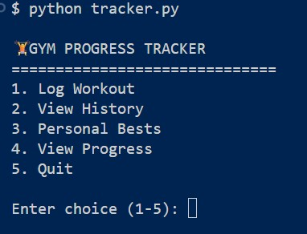
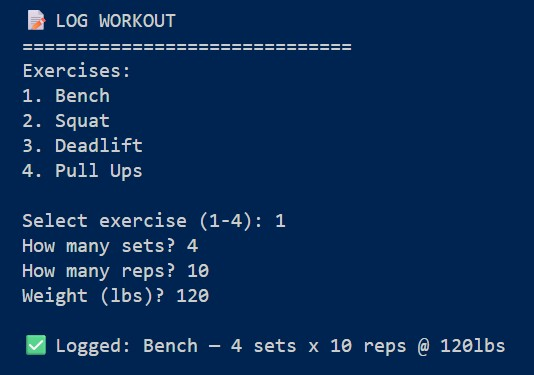
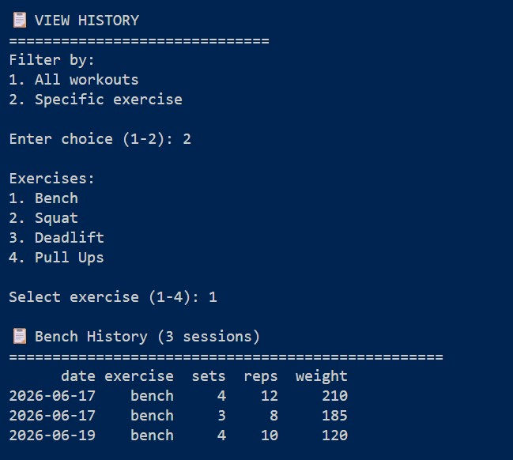

# 💪 Gym Progress Tracker

A command-line workout tracking app built with Python and Pandas.

## Features
- Log workouts (exercise, sets, reps, weight)
- View full workout history
- Filter history by exercise
- Track personal bests automatically
- Monitor progress over time

## Technologies Used
- Python
- Pandas
- CSV data persistence

## How To Run
1. Clone the repo
2. Install dependencies: `pip install pandas`
3. Run: `python tracker.py`

## Exercises Tracked
- Bench Press
- Squat
- Deadlift
- Pull Ups

## Screenshots

### Welcome Screen

### Logging a Workout

### Workout History 

## Author
Marco Moya